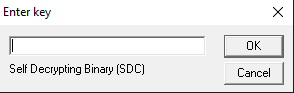

```
+------------------------------------------------------------------------------+
               SDC - Self Decrypting Binary Generator
          Copyright (C) 2006 Claes M Nyberg <cmn@signedness.org>
+------------------------------------------------------------------------------+
```
### -=[ What is this
	The SDC program creates self decrypting binaries for common operating systems
	and architectures. The target file is encrypted using Blowfish in Ciphertext
	Feedback Mode (CFB) and appended to an executable which reads itself and
	attempts to decrypt the appended data when it is run.

### -=[ Building
	Running 'make' in the src directory will present a few options:
```
	$ make

	make <target>

	SDC generator targets:
  		linux_x86
  		windows_x86
  		openbsd_x86
  		openbsd_arm
  		openbsd_sparc64
  		freebsd_x86
  		netbsd_x86
  		solaris_sparc

	Self decrypt targets:
  		selfdecrypt_linux_x86
  		selfdecrypt_windows_x86
  		selfdecrypt_openbsd_x86
  		selfdecrypt_openbsd_arm
  		selfdecrypt_openbsd_sparc64
  		selfdecrypt_netbsd_x86
  		selfdecrypt_freebsd_x86
  		selfdecrypt_solaris_sparc
```
	The SDC generator targets will build an sdc binary for that platform which
	can be used to generate a self decrypting file for any of the self decrypt targets.

	Building a "Self decrypt target" will build the actual self decrypting binary for that target.
	Strip it from symbols and run the genhex.pl script on the resulting selfdecrypt binary together 
	with its length to output an escaped string which can be redirected to create a header file, 
	just like one of those inside the targets directory. Then add the include file to targets.h t
	o add it to the sdc binary when it is built next time.

	The presented targets does already exist as header files and are already included into the sdc binary.

### -=[ ToDo
	* Add compression of the file before encryption to increase confusion.
	* OpenBSD ARM support
	* MacOSX Support

### -=[ Bugs and Limitations
	In order for the elf_offset() routine to work, the ELF file (selfdecrypt) 
	should be stripped (I'm to lazy to calculate size of string table).

### -=[ Example
```
	 ./sdc /etc/services
	Encryption key:
	Verify key:
	Writing self decrypting file services.sdc for Linux x86 (ELF)
	 ./services.sdc
	Encryption key:
	Decrypting to services
	$
```
Generate a self decrypting file for Windows on Linux
```
	$ ./sdc -t Windows_x86 /etc/services
	Encryption key:
	Verify key:
	Writing self decrypting file services.sdc.exe for Windows x86 (PE-COFF)

```
When double clicking on the services.sdc.exe a dialog windows is presented
to enter the decryption key:


